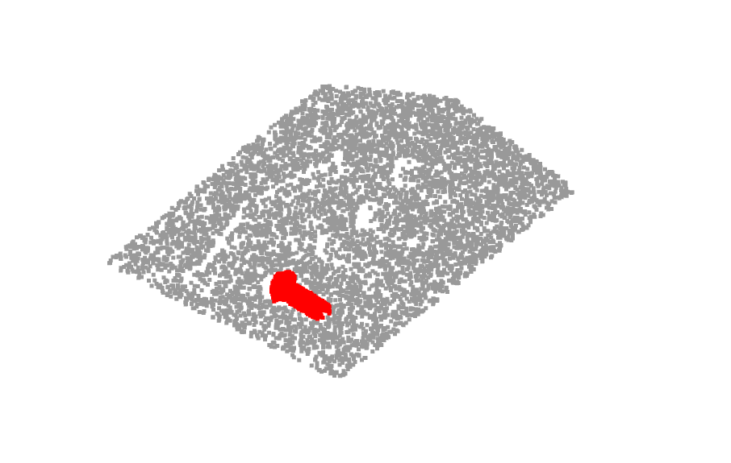

# Graspnet-3d
PointNet-based 3D screw detection for robotic grasping

## Objective

To build a real-time 3D screw segmentation system using PointNet++ that
can:
- Identify and segment a single screw among background noise.
- Achieve high inference speed and accuracy. (99.01)
- Be used in robotic applications for precise grasping.

## Dataset Overview

Raw Data Format (.txt)\
- Each file contains variable-length point clouds (e.g., ~221,928
points)
- Format per line: x, y, z, label, nx, ny, nz

Labels:
- 0 = background
- 1 = screw

## Preprocessing

Converted Format (.npz)
- Downsampled to fixed-size 8192 points per sample
- Saved in preprocessed_data/sample_000.npz to sample_297.npz
- Contents per file:
points: shape (8192, 6) \# \[x, y, z, nx, ny, nz\]
labels: shape (8192,) \# 0 or 1

## Model Architecture

Network: Based on PointNet++ semantic segmentation architecture\
- Input: \[B, 6, N\]
- Output: \[B, N, 2\]
- Input Channels: 6 (xyz + normals)
- Output Classes: 2 (background, screw)

## Training

Framework: PyTorch
- Dataset loader: ScrewSegTxtDataset
- Optimizer: Adam
- Learning rate: 1e-3
- Batch size: 16
- Epochs: 20

- Final model: pointnet2_screw_segmentation_final.pth

## Inference

Predicting a Sample:
- Load a sample .npz file
- Format input for PointNet++ as \[1, 6, 8192\]
- Get predicted labels from model output

Visualization using Open3D:
- Color background as gray \[0.6, 0.6, 0.6\]
- Color screw as red \[1.0, 0.0, 0.0\]
- Visualize using o3d.visualization.draw_geometries

## Results

Input Points: 8192
Classes: Background (0), Screw (1)
Example Output: 969 screw points detected in sample

